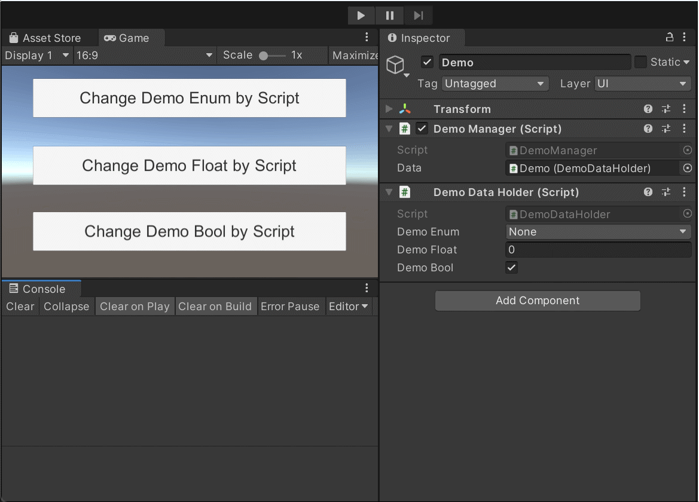

# Unity Observable Variables

**A simple Unity variable that can be monitored and controlled both via the inspector panel and code.**

<p align="center">
  
</p>

<div align="center">
  
  
</div>

## Simple 
<p align="center">
  
</p>

## Why develop?
The default Unity inspector doesn't handle listening to value changes very well. If you use get and set, a lot of code is required to sync the value with the inspector. To solve this pain point, I wrote this. It's very simple, and anyone can write something to handle it. It's not a difficult task. This is for my own use, but if you find it useful and want to use it, please give me a star!
##

## How To Use

Inherit from DataHolder, use WatchProperty in the script to attach it to the GameObject, and then add a reference to the data in your Manager.

```
public enum ObservableVariablesDemoEnum { None, Up, Down }

[System.Serializable]
public class WatchPropertyObservableVariablesDemoEnum : WatchProperty<ObservableVariablesDemoEnum>
{
    public WatchPropertyObservableVariablesDemoEnum(ObservableVariablesDemoEnum value, Action<ObservableVariablesDemoEnum, ObservableVariablesDemoEnum> callback = null, bool doOnChange = false)
        : base(value, callback, doOnChange) { }
    public WatchPropertyObservableVariablesDemoEnum(Action<ObservableVariablesDemoEnum, ObservableVariablesDemoEnum> callback = null, bool doOnChange = false)
       : base(callback, doOnChange) { }
}

public class DemoDataHolder : WatchPropertyDataHolder
{
    //if a value is provided during declaration, the script will use that value for initialization at runtime.
    //If no value is provided during declaration, the value from the inspector panel will be used as the initialization value.

    public WatchPropertyObservableVariablesDemoEnum demoEnum = new WatchPropertyObservableVariablesDemoEnum(ObservableVariablesDemoEnum.None);

    public WatchPropertyFloat demoFloat = new WatchPropertyFloat(1f);

    public WatchPropertyBool demoBool = new WatchPropertyBool();
}
```

```
 public class DemoManager : MonoBehaviour
 {
     public DemoDataHolder data;

     void Awake()
     {
         data.demoFloat.OnChangeEvent += OnDemoFloatChange;
     }

     void OnDemoFloatChange(float old, float now)
     {

         Debug.Log($"OnDemoFloatChange,Now Value:{now}");
     }

     public void ChangeDemoFloatByScript()
     {
         data.demoFloat.Value += 1f;
     }
 }
```

### Notice

When modifying a variable in the inspector, all OnChange events will be triggered. However, this won't happen in the compiled version of the program, so for me, this is sufficient.